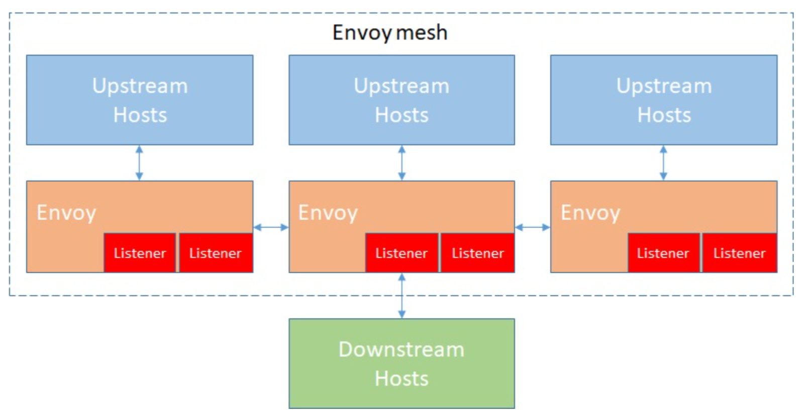
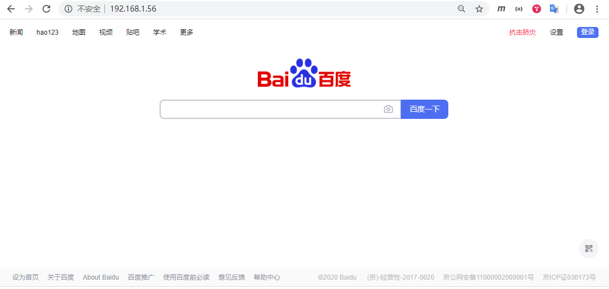
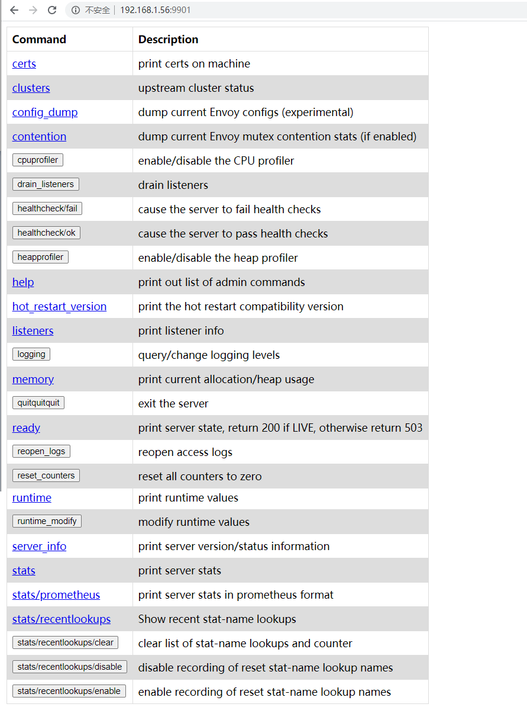

# Envoy 1.14.1配置入门

Envoy架构图。

Envoy中的一些术语。

- Host：能够进行网络通信的实体（如服务器上的应用程序）。

- Downstream：下游主机连接到Envoy，发送请求并接收响应。

- Upstream：上游主机接收来自Envoy连接和请求并返回响应。

- Listener：可以被下游客户端连接的命名网络（如端口、unix套接字）。

- Cluster：Envoy连接到的一组逻辑上相似的上游主机。

- Mesh：以提供一致的网络拓扑的一组主机。

- Runtime configuration：与Envoy一起部署的外置实时配置系统。

官方没有提供二进制安装包，但提供了Envoy的Docker镜像。

    docker pull envoyproxy/envoy:v1.14.1

Envoy的启动配置文件分为两种方式：静态配置和动态配置。

- 静态配置是将所有信息都放在配置文件中，启动的时候直接加载。

- 动态配置需要提供一个Envoy的服务端，用于动态生成Envoy需要的服务发现接口，这里叫XDS，通过发现服务来动态的调整配置信息，Istio就是实现了v2的API。

本文以静态配置为例，配置流量代理到百度。

    vi envoy.yaml
    static_resources:
      listeners:
      - name: listener_0
        address:
          socket_address: { address: 0.0.0.0, port_value: 10000 }
        filter_chains:
        - filters:
          - name: envoy.http_connection_manager
            config:
              stat_prefix: ingress_http
              route_config:
                name: local_route
                virtual_hosts:
                - name: local_service
                  domains: ["*"]
                  routes:
                  - match: { prefix: "/" }
                    route: { host_rewrite: www.baidu.com, cluster: service_baidu }
              http_filters:
              - name: envoy.router
      clusters:
      - name: service_baidu
        connect_timeout: 0.25s
        type: LOGICAL_DNS
        dns_lookup_family: V4_ONLY
        lb_policy: ROUND_ROBIN
        hosts: [{ socket_address: { address: www.baidu.com, port_value: 443 }}]
        tls_context: { sni: baidu.com }
    admin:
      access_log_path: /tmp/admin_access.log
      address:
        socket_address: { address: 0.0.0.0, port_value: 9901 }

#### 监听器（listeners）

监听器监听下游传入的流量，监听地址为 0.0.0.0，端口为 10000。

#### 过滤器（filters）

通过 listeners 监听传入的流量，过滤器定义如何处理这些请求。每个过滤器的目的是找到传入请求的匹配项，以使其与目标地址进行匹配。以上配置将所有流量代理到 baidu.com。

之所有增加`host_rewrite: www.baidu.com`配置是因为百度要求必须域名访问，如果不加该配置，在后面访问百度时需要添加主机头，`curl -H "Host: www.baidu.com" 127.0.0.1`。

#### 集群（clusters）

当请求与过滤器匹配时，该请求将会传递到集群。Envoy将一组逻辑上相似的上游主机定义为集群。上面定义了地址为 www.baidu.com, 端口为 443的主机。

注意过滤器中的cluster值和集群中的name值需要匹配。

启动容器，将配置文件映射到容器中。

    docker run --name=envoy-with-admin -d \
      -p 9901:9901 \
      -p 80:10000 \
      -v /root/envoy.yaml:/etc/envoy/envoy.yaml \
      envoyproxy/envoy:v1.14.1

    docker exec -it envoy-with-admin sh
    cat /etc/envoy/envoy.yaml

可以在宿主机访问Envoy，发现已经被代理到百度。

    curl 127.0.0.1
    <!DOCTYPE html>
    <!--STATUS OK--><html> <head><meta http-equiv=content-type content=text/html;charset=utf-8><meta http-equiv=X-UA-Compatible content=IE=Edge><meta content=always name=referrer><link rel=stylesheet type=text/css href=https://ss1.bdstatic.com/5eN1bjq8AAUYm2zgoY3K/r/www/cache/bdorz/baidu.min.css><title>百度一下，你就知道</title></head> <body link=#0000cc> 
 
 
 
 
 
  
 <form id=form name=f action=//www.baidu.com/s class=fm> <input type=hidden name=bdorz_come value=1> <input type=hidden name=ie value=utf-8> <input type=hidden name=f value=8> <input type=hidden name=rsv_bp value=1> <input type=hidden name=rsv_idx value=1> <input type=hidden name=tn value=baidu><input id=kw name=wd class=s_ipt value maxlength=255 autocomplete=off autofocus=autofocus><input type=submit id=su value=百度一下 class="bg s_btn" autofocus> </form> 
 
 
 <a href=http://news.baidu.com name=tj_trnews class=mnav>新闻</a> <a href=https://www.hao123.com name=tj_trhao123 class=mnav>hao123</a> <a href=http://map.baidu.com name=tj_trmap class=mnav>地图</a> <a href=http://v.baidu.com name=tj_trvideo class=mnav>视频</a> <a href=http://tieba.baidu.com name=tj_trtieba class=mnav>贴吧</a> <noscript> <a href=http://www.baidu.com/bdorz/login.gif?login&amp;tpl=mn&amp;u=http%3A%2F%2Fwww.baidu.com%2f%3fbdorz_come%3d1 name=tj_login class=lb>登录</a> </noscript>  <a href=//www.baidu.com/more/ name=tj_briicon class=bri style="display: block;">更多产品</a> 
 
 
 
 
 
 <a href=http://home.baidu.com>关于百度</a> <a href=http://ir.baidu.com>About Baidu</a> 
 
&copy;2017&nbsp;Baidu&nbsp;<a href=http://www.baidu.com/duty/>使用百度前必读</a>&nbsp; <a href=http://jianyi.baidu.com/ class=cp-feedback>意见反馈</a>&nbsp;京ICP证030173号&nbsp;  
 
 
 
 </body> </html>

可以访问管理视图。

    curl 127.0.0.1:9901
    <head>
      <title>Envoy Admin</title>
      <link rel='shortcut icon' type='image/png' href='data:image/png;base64,iVBORw0KGgoAAAANSUhEUgAAABgAAAAYCAYAAADgdz34AAAAAXNSR0IArs4c6QAAAARnQU1BAACxjwv8YQUAAAAJcEhZcwAAEnQAABJ0Ad5mH3gAAAH9SURBVEhL7ZRdTttAFIUrUFaAX5w9gIhgUfzshFRK+gIbaVbAzwaqCly1dSpKk5A485/YCdXpHTB4BsdgVe0bD0cZ3Xsm38yZ8byTUuJ/6g3wqqoBrBhPTzmmLfptMbAzttJTpTKAF2MWC7ADCdNIwXZpvMMwayiIwwS874CcOc9VuQPR1dBBChPMITpFXXU45hukIIH6kHhzVqkEYB8F5HYGvZ5B7EvwmHt9K/59CrU3QbY2RNYaQPYmJc+jPIBICNCcg20ZsAsCPfbcrFlRF+cJZpvXSJt9yMTxO/IAzJrCOfhJXiOgFEX/SbZmezTWxyNk4Q9anHMmjnzAhEyhAW8LCE6wl26J7ZFHH1FMYQxh567weQBOO1AW8D7P/UXAQySq/QvL8Fu9HfCEw4SKALm5BkC3bwjwhSKrA5hYAMXTJnPNiMyRBVzVjcgCyHiSm+8P+WGlnmwtP2RzbCMiQJ0d2KtmmmPorRHEhfMROVfTG5/fYrF5iWXzE80tfy9WPsCqx5Buj7FYH0LvDyHiqd+3otpsr4/fa5+xbEVQPfrYnntylQG5VGeMLBhgEfyE7o6e6qYzwHIjwl0QwXSvvTmrVAY4D5ddvT64wV0jRrr7FekO/XEjwuwwhuw7Ef7NY+dlfXpLb06EtHUJdVbsxvNUqBrwj/QGeEUSfwBAkmWHn5Bb/gAAAABJRU5ErkJggg=='/>
      
    </head>
    <body>
      <table class='home-table'>
        <thead>
          <th class='home-data'>Command</th>
          <th class='home-data'>Description</th>
         </thead>
         <tbody>
    <tr class='home-row'><td class='home-data'><a href='certs'>certs</a></td><td class='home-data'>print certs on machine</td></tr>
    <tr class='home-row'><td class='home-data'><a href='clusters'>clusters</a></td><td class='home-data'>upstream cluster status</td></tr>
    <tr class='home-row'><td class='home-data'><a href='config_dump'>config_dump</a></td><td class='home-data'>dump current Envoy configs (experimental)</td></tr>
    <tr class='home-row'><td class='home-data'><a href='contention'>contention</a></td><td class='home-data'>dump current Envoy mutex contention stats (if enabled)</td></tr>
    <tr class='home-row'><td class='home-data'><form action='cpuprofiler' method='post' class='home-form'><button>cpuprofiler</button></form></td><td class='home-data'>enable/disable the CPU profiler</td></tr>
    <tr class='home-row'><td class='home-data'><form action='drain_listeners' method='post' class='home-form'><button>drain_listeners</button></form></td><td class='home-data'>drain listeners</td></tr>
    <tr class='home-row'><td class='home-data'><form action='healthcheck/fail' method='post' class='home-form'><button>healthcheck/fail</button></form></td><td class='home-data'>cause the server to fail health checks</td></tr>
    <tr class='home-row'><td class='home-data'><form action='healthcheck/ok' method='post' class='home-form'><button>healthcheck/ok</button></form></td><td class='home-data'>cause the server to pass health checks</td></tr>
    <tr class='home-row'><td class='home-data'><form action='heapprofiler' method='post' class='home-form'><button>heapprofiler</button></form></td><td class='home-data'>enable/disable the heap profiler</td></tr>
    <tr class='home-row'><td class='home-data'><a href='help'>help</a></td><td class='home-data'>print out list of admin commands</td></tr>
    <tr class='home-row'><td class='home-data'><a href='hot_restart_version'>hot_restart_version</a></td><td class='home-data'>print the hot restart compatibility version</td></tr>
    <tr class='home-row'><td class='home-data'><a href='listeners'>listeners</a></td><td class='home-data'>print listener info</td></tr>
    <tr class='home-row'><td class='home-data'><form action='logging' method='post' class='home-form'><button>logging</button></form></td><td class='home-data'>query/change logging levels</td></tr>
    <tr class='home-row'><td class='home-data'><a href='memory'>memory</a></td><td class='home-data'>print current allocation/heap usage</td></tr>
    <tr class='home-row'><td class='home-data'><form action='quitquitquit' method='post' class='home-form'><button>quitquitquit</button></form></td><td class='home-data'>exit the server</td></tr>
    <tr class='home-row'><td class='home-data'><a href='ready'>ready</a></td><td class='home-data'>print server state, return 200 if LIVE, otherwise return 503</td></tr>
    <tr class='home-row'><td class='home-data'><form action='reopen_logs' method='post' class='home-form'><button>reopen_logs</button></form></td><td class='home-data'>reopen access logs</td></tr>
    <tr class='home-row'><td class='home-data'><form action='reset_counters' method='post' class='home-form'><button>reset_counters</button></form></td><td class='home-data'>reset all counters to zero</td></tr>
    <tr class='home-row'><td class='home-data'><a href='runtime'>runtime</a></td><td class='home-data'>print runtime values</td></tr>
    <tr class='home-row'><td class='home-data'><form action='runtime_modify' method='post' class='home-form'><button>runtime_modify</button></form></td><td class='home-data'>modify runtime values</td></tr>
    <tr class='home-row'><td class='home-data'><a href='server_info'>server_info</a></td><td class='home-data'>print server version/status information</td></tr>
    <tr class='home-row'><td class='home-data'><a href='stats'>stats</a></td><td class='home-data'>print server stats</td></tr>
    <tr class='home-row'><td class='home-data'><a href='stats/prometheus'>stats/prometheus</a></td><td class='home-data'>print server stats in prometheus format</td></tr>
    <tr class='home-row'><td class='home-data'><a href='stats/recentlookups'>stats/recentlookups</a></td><td class='home-data'>Show recent stat-name lookups</td></tr>
    <tr class='home-row'><td class='home-data'><form action='stats/recentlookups/clear' method='post' class='home-form'><button>stats/recentlookups/clear</button></form></td><td class='home-data'>clear list of stat-name lookups and counter</td></tr>
    <tr class='home-row'><td class='home-data'><form action='stats/recentlookups/disable' method='post' class='home-form'><button>stats/recentlookups/disable</button></form></td><td class='home-data'>disable recording of reset stat-name lookup names</td></tr>
    <tr class='home-row'><td class='home-data'><form action='stats/recentlookups/enable' method='post' class='home-form'><button>stats/recentlookups/enable</button></form></td><td class='home-data'>enable recording of reset stat-name lookup names</td></tr>

        </tbody>
      </table>
    </body>

也可以通过宿主机之外的浏览器访问，[http://192.168.1.56](http://192.168.1.56)。

管理视图，[http://192.168.1.56:9901](http://192.168.1.56:9901)。

